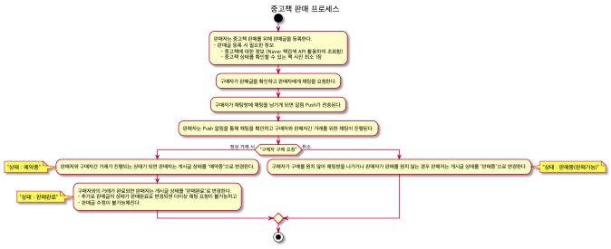

<p align="center">
  </a>
</p>

## 🚀 Intro

### 서비스 소개
- 요약 : 중고책 거래 플랫폼

- 기능을 정리하면 아래와 같습니다.
  - 책거래 회원을 등록할 수 있습니다. (OAuth를 통한 사용자 정보 요청)
  - Naver 책 검색 API를 통해 책정보를 조회할 수 있습니다.
  - 로그인한 사용자는 중고책 판매글을 등록, 수정, 삭제할 수 있습니다.
  - 판매글로 등록된 중고책을 조회할 수 있습니다. (판매글 목록 조회)
  - 원하는 중고책을 판매하는 판매글을 확인하면 판매자 ~ 구매자간 채팅을 통해 거래가 진행됩니다.
  
## ⚡️ Skills
기술 스택
### 환경 요약
- JDK 11
- Spring Boot 2.5.2
- Spring Data JPA
  - MySQL
  - MongoDB (채팅 내용 저장)
  - querydsl
- Web Socket
  - stomp-websocket
- Rest-Assured (인수테스트 구성)
- Spring REST Docs
  - spring-restdocs-asciidoctor
- Commons-lang3, Guava
- Jasypt (property 암호화)
- AWS 인프라 활용 (EC2, S3, RDB)
- Firebase-admin (push 알림 구현)
- intellij-java-google-style 적용
- java-jwt

### 프로젝트 빌드
- Gradle Multi Module Setting
  ```java
  rootProject.name = 'bookwhale-server'
  include 'api'
  include 'chat'
  include 'core'
  ```
- properties 내 민감정보 암호화
  - jasypt를 통한 암호화 처리 (https://github.com/ulisesbocchio/jasypt-spring-boot)

### 로그 설정
- Springboot 기본 설정된 logback 활용
  - ConsoleAppender
  - RollingFileAppender
  - SlackAppender (com.github.maricn.logback.SlackAppender)
    - AsyncAppender 활용

## 🛠 Project Architecture

시스템 구성도

## 🎥 Demo

데모

## 🏠 Members

|            [gentledot](https://github.com/GentleDot)             |            [highright96](https://github.com/highright96)             |  
| :----------------------------------------------------------: | :----------------------------------------------------------: 
|  | 
|                         백엔드                         |                        백엔드                         |  

